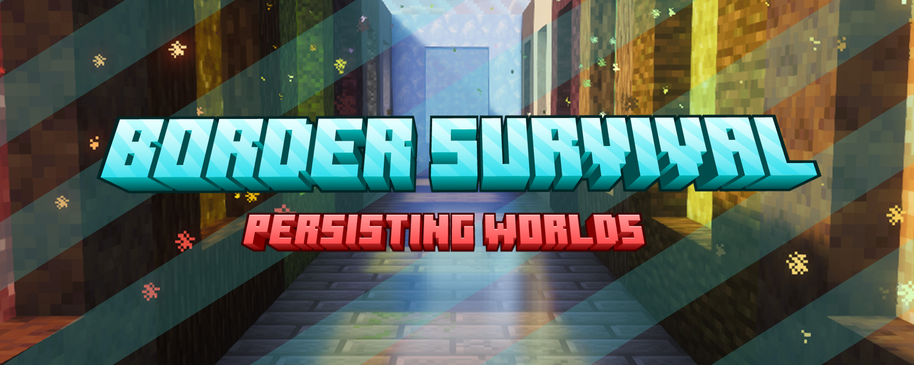

[](https://fndream.github.io/BorderSurvivalModpack/?lang=en)

## 📓 Introduction

This is a world series built around vanilla-style border survival. You start in a cramped space, gather what you need with your wits, declare war on the night with courage, and push the World Border outward with experience. It is made for players who already know how vanilla plays.

## 📗 Before You Play
- This is not a regular modpack. The **core mod** and the **dedicated world save** depend on each other, so you have to import this series' save after installing the modpack. The **FAQ** walks you through it.
- **The series stays true to vanilla, with no fixed goals.** It exists because the series' very first player **loved the look of the World Border and preferred long-form vanilla survival**. Those two preferences are what became this series.
- If you want the lay of the land first, skim the **Core Features, Resource Features, Expansion Features, World-Exclusive Features, World Library, Game Rules, and Helper Mod Keybinds**.
- **Or just jump straight in. Half the fun is not knowing what is out there.**
- We recommend playing with **resource packs** and **shader packs** you actually like.
- Supported languages: **Simplified Chinese, Traditional Chinese, Classical Chinese [recommended], English**.
- If you switch languages inside the game, some text only updates after you leave the save and come back.

## 🔆 Core Features
<details>
<summary>Click here to expand</summary>


### 📕 World Border
The World Border is a vanilla feature that arrived in Minecraft 1.8. The [Minecraft Wiki – World Border](https://en.minecraft.wiki/w/World_border) page has the details.

### 🥬 Border Energy
Every level of Border Energy adds 0.5 blocks to the World Border's radius. Spend **experience levels** at the **Border Upgrade** sign to level it up and push the World Border outward.

### 📋️ Function Signs
Every world in this series puts three function signs at the world spawn point. Walk up, right-click one, and its function fires.

- **Border Upgrade** — Spends experience levels to raise Border Energy.
- **Switch Mode** — Flips between Day/Night Mode and Locked Mode. See **Expansion Features** for what border modes actually do.
- **Summon Chaos Smith** — Calls a Chaos Smith to your position, only once per game day. Only one can be alive in loaded chunks at a time. See **Expansion Features** for more on the Chaos Smith.

> Function signs have a hardness of -1 and a blast resistance of 3,600,000.

### 🧱 Advancements
> ❗ This series sets no fixed goals. Advancements are **not a quest guide** — they exist to showcase features, give text hints, and give the journey a sense of occasion.  
> ❗ **This series never hands you a step-by-step walkthrough.**


</details>

## 🌿 Resource Features
<details>
<summary>Click here to expand</summary>


### 🎣 Fishing
Fishing sometimes turns up items that are common in certain biomes.

- Junk loot pool now includes: Seagrass, Kelp, Sugar Cane, Cactus, Bamboo, Sea Pickle, Cocoa Beans, Prismarine Shard, Prismarine Crystals, Coral, Coral Fan, Chorus Flower.
- Treasure loot pool now includes: Budding Amethyst, Obsidian, Ice, Packed Ice, Blue Ice, Coral Block, "? ? ?".

### 🐱 Cats
Share a bed with a cat and it may give you some special gifts:

- Gift loot pool now includes: Leaves, Diamond.

### 🌹 Sniffers
When a Sniffer finishes digging, it may toss out some small flowers:

- Dig loot pool now includes: Dandelion, Poppy, Blue Orchid, Allium, Azure Bluet, Tulip, Oxeye Daisy, Cornflower, Lily of the Valley, Open Eyeblossom, Spore Blossom, Dead Bush.

### 🐽 Piglins
Hand a Piglin a gold ingot and it may toss out some special Nether Fortress loot:

- Barter loot pool now includes: Blaze Rod, Nether Wart, Wither Skeleton Skull.

### 💎 Loot Chests
Open the matching loot chest and you may walk away with something special:

- Plains Village Houses now include: Sunflower, Rose, Peony, Lilac, Pink Petals, Wildflowers, Leaf Litter, Glow Lichen.
- Acacia Village Houses now include: Armadillo Scute, Bush, Firefly Bush, Red Shrub.
- Village Mason Houses now include: Pointed Dripstone, Sulfur Spike.
- Shipwreck Supply Chests now include: Pale Moss Block, Pale Hanging Moss.
- Buried Treasure now includes: Turtle Egg.
- End City chests now include: Shulker Shell.
- Bastion Remnant Hoglin Stables now include: Crimson Nylium, Warped Nylium.
- Normal Trial Chamber Vaults and Ominous Trial Chamber Vaults now include: Breeze Rod.

### ⚫ Ender Dragon
- Defeat the Ender Dragon once and a Dragon Head spawns on the End Podium.
- Defeat a respawned Ender Dragon and a Dragon Egg and a Dragon Head spawn on the End Podium.

###  ⬛ Deepslate
- Deepslate and Cobbled Deepslate form wherever lava meets water below Y=0.

### 💡 Recipes

> Recipes unlock automatically once you obtain the materials. Read them in the little green book to the left of the Crafting Table:


### ⬛ Monster Spawners
Break a Monster Spawner with a tool enchanted with Silk Touch and it drops an empty spawner.

> **Monster Spawner spawn conditions:**  
> Spawn range: 4 blocks horizontally, 1 block vertically, ignoring biomes.  
> Slime: does not require a Slime Chunk.  
> Iron Golem: solid blocks must exist below the spawn position.  
> Animals: a Grass Block must exist below the spawn position.  
> Aquatic monsters (such as Drowned / Guardian / Elder Guardian): water (source or flowing) must exist within the spawn range.  
> Aquatic animals (such as Squid / Cod / Salmon / Dolphin): water (source or flowing) must exist within the spawn range, and the water must sit in the ocean range (Y 50–63).  
> Glow Squid: water (source or flowing) must exist within the spawn range, and the water must sit in the cave range (below Y 30).

### 🌿 Carpet Mod & Addition
**✅ Enabled by default:**
- Double barrels: when two barrels are joined back to back, you can use both container spaces at once.
- Renewable sand: cobblestone struck by a falling anvil turns into sand.
- Soul sand conversion: sand under a mob that dies to fire turns into soul sand.
- Renewable sponges: a Guardian struck by lightning turns into an Elder Guardian.
- Renewable wither skeletons: a Skeleton struck by lightning turns into a Wither Skeleton.
- Renewable coral: bone meal grows coral.
- Renewable shulker shells: Shulkers spawn in End Cities.
- Spider Jockeys drop Enchanted Golden Apples.
- Stackable Shulker Boxes: empty Shulker Boxes on the ground stack into one.
- Empty Shulker Boxes always stack: they also stack inside your inventory.
- Persistent fake players: fake players stay behind when you quit.
- Fake-player fishing: fake players fish on their own.
- Fake-player inventory: right-click a fake player to open its inventory.
- Fake-player Ender Chest: sneak and right-click a fake player to open its Ender Chest.

### 📙 Grindstone Enchantments (grind-enchantments mod)
- A grindstone can pull an enchantment off gear and into a book, or move the first enchantment of an enchanted book onto another book.


</details>

## 🌙 Expansion Features
<details>
<summary>Click here to expand</summary>

### 💠 Border Modes
- Two modes, **Locked** and **Day/Night**, and you can switch between them in game.

### 🔵 Locked Mode
- The default mode.

### 🌗 Day/Night Mode
- Daytime behaves exactly as it does in Locked Mode.
- At night, the **mob cap** rises to **140**, **mobs per spawn** rises to **10**, the **chance that mobs spawn wearing armor** rises to **30%**, and mobs spawn **regardless of light level**.
- At night, Border Energy of **level 50 or more** doubles the space you have.

### 🌙 Day/Night Mode - Eternal Night
- One minute before a Day/Night night ends, an Eternal Night falls if your Border Energy has reached **level 100**.
- Once it falls, Evernight Knights from another realm appear around the world spawn point.
- Under their influence, time locks to the moment they arrived and the world sinks into an endless thunderstorm.
- Only defeating every Evernight Knight that descended breaks their hold on the world.
- It returns once you have lived through or slept through **0–4** more Day/Night nights.
> In Peaceful Mode an Eternal Night ends immediately, and none will ever begin.

### 🧊 Eternal Rain Night / Eternal Snow Night
- Once the Eternal Night falls, the Evernight Knights can stain the World Border with any of six colors: **Pale White, Danger Red, Sun Orange, Bright Gold, Deep Blue, Dark Purple**.
- The stronger their influence, the more the climate unravels and the more likely mobs are to spawn wearing armor.
- While the World Border shows **Bright Gold, Sun Orange, or Deep Blue**: every biome rains no matter whether it is cold or warm, and the armor chance rises to **40% / 50% / 60%**.
- While the World Border shows **Dark Purple, Danger Red, or Pale White**: every biome snows no matter whether it is warm or cold, and the armor chance rises to **70% / 80% / 90%**.
- Once every Evernight Knight is defeated, the climate recovers, the World Border's colors fade back, and the color that returns warns you which kind of Eternal Night is coming next.
> You can also read the arrival of the next Eternal Night off the moon phase on the Day/Night clock.

### 🐎 Evernight Knight
- An Evernight Knight's max health climbs along with your Border Energy.
- It regenerates health for as long as no player is nearby.
- Every time it takes damage, the world itself stirs and spawns more mobs.
- Defeating one makes it drop a random dimension's loot chest.
- Because it counts as a World Bug, every mob wants it dead.
> Evernight Knights only appear at random spots inside a 16-block square centered on the world spawn point, always on the highest exposed ground; in cave-type worlds they never appear above Y 96.  
> Evernight Knights are extremely dangerous. Bring solid defenses and real healing before you try to duel one.  
> Evernight Knights never leave their dimension and never ride vehicles.

### 🔱 Evernight Legion
- After every **3** Eternal Nights survived, the next one brings an **Undead Legion** or an **Illager Legion**.
- After every **8** Eternal Nights survived, the next one brings the **Evernight Legion**.

### 💙 Eternal Heart
- Defeat a legion boss and it drops an **Eternal Heart**.
> **Right-click** the heart to destroy it, and the Evernight Knights will no longer fight as one in the current or next Eternal Night.  
> An Eternal Heart counts as a Heart of the Sea when used.

### 🏹 Cursed Eternal Weapons
- A defeated Evernight Knight has a **1%** chance to drop the weapon it was holding.
- Holding a Looting weapon in your main hand adds **8.5%** per level of Looting to that drop chance.
> Cursed Eternal Weapons carry Curse of Vanishing and cannot be destroyed by fire, lava, explosions, lightning, or cacti.  
> A Cursed Eternal Weapon with no extra enchantments can be returned to its origin as a Night Spirit Eternal Weapon.

### 🍖 Mob Drops
- Mobs defeated by **Evernight Knights, Wardens, Elder Guardians, Guardians, and Iron Golems** count as player kills.

### 🐞 World Bugs
- Evernight Knights, Sustainers, and Chaos Smiths are World Bugs.
- Every mob within 384 blocks horizontally will aggro the World Bug.
- A mob below the World Bug chases it 16 blocks down.
- A mob above the World Bug in a **vanilla or amplified** world chases it infinitely far down if the World Bug sits at Y 48 or higher, and 16 blocks otherwise.
- A mob above the World Bug in a **floating island, cave, or void** world chases it infinitely far down.
- Mobs other than Evernight Knights and Night Riders do not fight back while chasing the World Bug.
- If a player is in line of sight, a mob chasing the World Bug switches to that player first.
> Endermen will not aggro a player who is not looking at them.  
> Evokers chase the World Bug 384 blocks horizontally and 384 blocks vertically.  
> A Drowned chasing the World Bug sees through blocks once it is within 16 blocks of it.  
> A Creeper chasing the World Bug sees through blocks once it is within 8 blocks horizontally and 4 blocks vertically, and will ignite itself on the spot if its path is blocked.  
> Creepers never back away from the World Bug on their own.

### 🐈 Sustainer
- A Sustainer descends at the world spawn point and keeps Border Energy stable.
- Without a Sustainer near the world spawn point, Border Energy drains continuously.
- If a Sustainer strays too far from the world spawn point, it heads back.
- If a Sustainer dies, it descends again at the world spawn point after a while.
- Because it counts as a World Bug, every mob wants it dead.
> While a Chaos Smith is nearby, a Sustainer heals nearby players.  
> Sustainers are baby cats and can be tamed and given gifts like any other cat.  
> Sustainers never leave their dimension and never ride vehicles.

### 🔆 Chaos Smith
- An armorer villager who masters Chaos Star smithing and has a lot in common with the Evernight Knights. You can trade one for special items — see below.
- Because it counts as a World Bug, every mob wants it dead.
> Chaos Smiths are armorer villagers, and they breed and restock like any other.  
> A Chaos Smith outside loaded chunks does not count as existing.

### 🪵 Unbreakable Spirit Material
Unbreakable Spirit Material is what is left of a Chaos Star — itself a fusion of a Heart of the Sea, a Nether Star, and an End Crystal — once the Chaos Smith has refined it. Gear forged from it has **no durability at all**; see below.
> Hold Unbreakable Spirit Material and right-click the **Border Upgrade** sign to infuse it, raising your Border Energy by a set amount.

### ✨ Unbreakable Spirit Equipment
Gear forged by the Chaos Smith out of Unbreakable Spirit Material, with **no durability** at all.

**The following Unbreakable Spirit equipment grants an effect while held in the offhand:**

- **Chaos Star**: Regeneration II
- **Spirit Shears**: Haste II
- **Spirit Brush**: Fire Resistance
- **Spiritguard Shield**: Absorption V
- **Spirit Lure Rod**: Speed II
- **Warped Spirit Lure Rod**: Speed II
- **Blessing of the Sea**: Conduit Power
- **Vast Sea Spirit Trident**: Dolphin's Grace
- **Whirling Spirit Mace**: Strength III
- **Soaring Spirit Wings**: Slow Falling
- **Soaring Spirit Wingplate**: Slow Falling
- **Spirit Wolf Armor**: Resistance II; while a Wolf wears it, it also grants Instant Health.
- **Spirit Flint and Steel**: the holder, plus Evernight Knights, Chaos Smiths, Illagers, Witches, Wandering Traders, and Trader Llamas, all glow continuously.

### 📦 ? ? ?
- The mysterious chest the Chaos Smith forges out of a Spirit Emerald. Place it, open it, and:
  - there is a high chance you get a random structure loot chest;
  - a moderate chance you get a random village loot chest;
  - a low chance you get a random treasure loot chest.

### 🍀 Spirit Emerald
> A Spirit Emerald counts as an Emerald when used.
- **Gathering items**:
    - **General Spirit Emerald**: hold one in your offhand or place it in any Item Frame, and it pulls every item entity inside the 16-block (33x33x33) cube around it into its own position.
    - **Container Spirit Emerald**: if the Item Frame holding it is attached to a Chest, Barrel, or Shulker Box, it only gathers item types found in that container. Attached to an empty container, it gathers nothing at all.
    - When several **General** Spirit Emeralds sit near one item entity, the nearest one takes it.
    - When several valid **Container** Spirit Emeralds sit near one item entity, the item splits into several entities that they gather equally.
    - If **General** and **Container** Spirit Emeralds are both in range, the nearest General one takes the item first, then the Container ones share it out equally.
- **Converting to building blocks**: use a Stonecutter to convert it into a set amount of basic blocks:


</details>

## 🌕 World-Exclusive Features
<details>
<summary>Click here to expand</summary>


> ❗ The following features belong to one specific world and only work there.

### 🌸 Guardian - Cherry Mountain (Cherry Valley)
- <del>A Chaos Smith exists, and every mob wants to kill it. When it dies, Border Energy drains.</del> (replaced by the Sustainer)

### 🌑 Evernight - Night Garden
- The world runs on a night-only cycle. There is no day.
- Locked into Day/Night Mode, which cannot be switched.
- Villager schedules run backwards: villagers and players can only sleep after tick 23000.
- <del>A Sustainer exists, and every mob wants to kill it. When it dies, Border Energy drains.</del> (now permanent)

### 🔥 Void Portal - Persisting Worlds
- Build a portal frame out of a dimension's own theme blocks and light it with a fire source to travel to that dimension.
- Unlike a Nether Portal, a Void Portal searches for the nearest matching portal within 256 blocks of the target dimension's world spawn point, no matter where you entered from. If it finds none, it builds a portal structure near the world spawn point.
- Every Persisting dimension keeps its own Border Energy, except the Nether and the End.
- Every Persisting dimension has its own Sustainer, except the Nether and the End.
- Evernight Knights only descend into the Overworld or a Persisting dimension whose Border Energy has reached **level 100**, excluding the Nether and the End.
- If several dimensions hold **level 100** or more, Evernight Knights descend at random into one of them that has at least one player who is not in Spectator Mode.
- If no dimension qualifies, they try the Overworld first; if its Border Energy is below **level 100**, they do not descend at all.


</details>

## 🧭 World Library

> **You must use a dedicated world save.** Create your own world instead and the game will not work as intended.  
> Worlds are sorted by **type and overall difficulty, hardest first**. More stars usually mean a rougher survival or a longer grind.

<details>
<summary>Click here to expand the world library</summary>

### 🔥 **Void Fifteen Realms — Persisting Worlds Array Island**
🔥 **Type: 6th Anniversary — Void**  
✨ **Difficulty: 🔥🔥🔥**


---
> Void Realms, Blocks become doorways, Primordial fire reveals, World Persists…  
> A Void Fifteen Realms - Persisting Worlds world built around the fishing pool of the original Persisting Worlds author's save, which now serves as the world spawn point. It includes:  
> Border Energy 00: a Rainbow Beacon  
> Border Energy 16: a Seven-tier Stairway to the Sky  
> Border Energy 28: an auto-sorting warehouse for Spirit Emeralds (84 sorting cells + 4 cache tiers + 16-block proximity hub)  
> Border Energy 42: a ring-shaped treasure fishing pool that never freezes  
> Border Energy 90: an outer ring of micro-biomes for Void Portals  
> Border Energy 99: the complete array island
> 
> Release date: 2026-09-01 - 26.2
---

### 🔥 **Void Fifteen Realms — Persisting Worlds**
🔆 **Type: 6th Anniversary — Void**  
✨ **Difficulty: 🔥🔥🔥🔥🔥**


---
> Void Realms, Blocks become doorways, Primordial fire reveals, World Persists…
> 
> Release date: 2026-06-23 - 26.2

---
### 🌑 **Cursed Evernight World — Night Garden**
🥥 **Type: 5th Anniversary — Floating Island**  
⚡ **Difficulty: 🌙🌙🌙🌙🌙🌙**  


---
> A realm where the heavens lose their color, where curses and the Evernight cycle…  
> Dance with the monsters… live in symbiosis with the chaos…  
> 
> Portal frame: Pale Moss Block  
> Release date: 2025-01-15 - 1.21.4
---
### 🌿 **Gloom Axolotl World — Lush Caves**
🛖 **Type: 4th Anniversary — Cave**  
✨ **Difficulty: 🌿🌿🌿🌿🌿**


---
> Legend tells of a land of gloom axolotls…  
> Its vegetation stretches on without end, its darkness is boundless…  
> Its people dance in the pools, its monsters swarm the hollow earth…  
> It is a lush, magnificent cave; it is a barren, threadbare world…  
> It is a dim dimension, and a paradise dotted with starlight…  
> —A diary left behind by a certain Chaos Smith
> 
> Portal frame: Moss Block  
> Release date: 2024-08-17 - 1.21.1

---

### 🌺 **Idyll Beyond World — Cherry Valley**
🍀 **Type: 3rd Anniversary — Vanilla**    
✨ **Difficulty: 🌸🌸**


---
> Once, a Chaos Smith was trapped in a valley of cherry blossoms.  
> Now, whenever the moon is high, endless chaos still rises here.  
> What has changed is that the Sustainer has taken over the guardianship of this land… 
> 
> Portal frame: Cherry Wood  
> Release date: 2024-02-09 - 1.20.4

---

### ⛅ **Void**
🔆 **Type: Void**  
⚡ **Difficulty: 🔆🔆🔆🔆🔆🔆**


---
> A world where both the Overworld and the Nether are void.  
> **Only attempt this if you have plenty of time and a solid grasp of both vanilla and core mechanics.**
> 
> Release date: 2024-11-10 - 1.21.1

---

### 🦠 **Painted Grotto — Sulfur Caves**
🛖 **Type: Cave**  
✨ **Difficulty: ⭐⭐⭐⭐⭐**


---
> A 26.2-themed world: an underground realm like an ancient scroll painting.
> 
> Portal frame: Chiseled Sulfur  
> Release date: 2026-06-23 - 26.2

---

### 🌳 **Lakes Peaks Place — Spruce Floating Island**
🥥 **Type: Floating Island**     
✨ **Difficulty: ⭐⭐⭐**


---
> A floating isle ringed with spruces, a holy place for builders.  
> **This world's terrain is generated by kinbee's [RevampedFloatingIslands](https://modrinth.com/datapack/revamped-floating-islands) datapack!**
> 
> Portal frame: Spruce Wood  
> Release date: 2025-12-18 - 1.21.10

---

### 🌿 **Abundant Rain Realm — Lush Floating Island**
🥥 **Type: Floating Island**  
✨ **Difficulty: ⭐⭐⭐**


---
> A jungle isle sitting on a giant lush floating island.  
> **This world's terrain is generated by kinbee's [RevampedFloatingIslands](https://modrinth.com/datapack/revamped-floating-islands) datapack!**
> 
> Portal frame: Clay  
> Release date: 2025-12-18 - 1.21.10

---

### 🧊 **Extreme Ice Realm — Frozen Icebergs**
💠 **Type: Amplified**  
✨ **Difficulty: ⭐⭐⭐⭐**


---
> A frozen land, and peaks that pierce the clouds.  
> Ice spires breaking the surface, an ocean sealed to every horizon.
> 
> Portal frame: Blue Ice  
> Release date: 2024-04-24 - 1.20.4

---

### 🌴 **Coral Rain Bamboo Land — Jungle Island**
🍀 **Type: Vanilla**  
✨ **Difficulty: ⭐⭐⭐**


---
> An island of coral seas, jungles, and bamboo groves.
> 
> Portal frame: Jungle Wood  
> Release date: 2025-02-02 - 1.21.4

---

### 🍁 **Sunfall Gorge Forest — Dappled Valley**
🍀 **Type: Vanilla**  
✨ **Difficulty: ⭐⭐**


---
> A 26.3-themed world: a basin holding both a Dappled Forest and a Cherry Grove.
>
> Portal frame: Poplar Wood  
> Release date: 2026-09-25 - 26.3

---

### 🌿 **Savanna In Swamp — Swamp Savanna**
🍀 **Type: Vanilla**  
✨ **Difficulty: ⭐⭐**


---
> A 1.19-themed world: Acacia Plains and Plains Villages ringed by Mangrove Swamp.
> 
> Portal frame: Mud  
> Release date: 2022-06-18 - 1.19

---

### 🪵 **Hollow Forest Pool — Verdant Lake**
🍀 **Type: Vanilla**  
✨ **Difficulty: ⭐⭐**


---
> A 1.20-themed world: a Cherry forest and a heart-shaped Plains lake ringed by steep peaks.
> 
> Portal frame: Oak Wood  
> Release date: 2025-12-21 - 1.21.10

---

### 🌸 **Summit Cherry Blossoms — Cherry Plain**
🍀 **Type: Vanilla**  
✨ **Difficulty: ⭐⭐**


---
> A 1.20-themed world: a Cherry forest ringed by steep peaks.
> 
> Portal frame: Cherry Log  
> Release date: 2024-01-29 - 1.20.4

---

### 🌵 **Three Shores Biome — Coastal Settlement**
🍀 **Type: Vanilla**    
✨ **Difficulty: ⭐**


---
> Above a coast spanning three biomes sits a lively seaside town.  
> A coral sea biome — good for players who love the sea and building underwater.  
> A memorial piece for this series' very first world, Island Village.
> 
> Portal frame: Smooth Sandstone  
> Release date: 2024-02-03 - 1.20.4

---

### 🔱 **Departure Land — Island Village**
🍀 **Type: Vanilla**    
✨ **Difficulty: ⭐**


---
> "A dream, and the place to start over."
>
> Portal frame: Poplar Log  
> Release date: 2026-09-25 - 26.3

---

</details>

## 📕 Game Rules
<details>
<summary>Click here to expand</summary>

- ❗ **Experience drops on death even with Keep Inventory on.**
- ❗ **Curse of Vanishing still applies even with Keep Inventory on.**

> ❌ The vanilla `/gamerule mobGriefing false` command is often used to stop Creepers from blowing holes, but it also stops villagers from picking up food, Piglins from picking up gold ingots, and mobs from picking up armor and tools.

> You can also toggle every rule below quickly: **ESC -> World Options -> Edit Game Rules -> search "Allow" -> Mobs**.

> ✅ To stop Creepers from blowing blocks up:  
> ```
> /gamerule creeper_griefing false
> ```

> ✅ To stop Endermen from picking up blocks:  
> ```
> /gamerule endman_griefing false
> ```

> ✅ To stop Zombies from breaking doors:  
> ```
> /gamerule zombie_griefing false
> ```

> ✅ To stop Ghasts from wrecking terrain with fireballs:  
> ```
> /gamerule ghast_griefing false
> ```

> ✅ To stop Ravagers from destroying blocks:  
> ```
> /gamerule ravager_griefing false
> ```

> ✅ To stop mobs from trampling farmland:  
> ```
> /gamerule farmland_griefing false
> ```

> ✅ To stop players from trampling farmland:  
> ```
> /gamerule farmland_player_griefing false
> ```


</details>

## 🎓 Helper Mod Keybinds
<details>
<summary>Click here to expand</summary>


**The modpack binds keys to a few mod features:**

| Keybind | Action |
|:----------------------------|:---------------------------------------|
| **Right-click** a villager trade offer | Trade all at once |
| **Middle-click** a villager trade offer | Pin the trade |
| **R**                       | Sort inventory / chest (hover an item first) |
| **Shift**                   | Preview Shulker Box contents |
| **G, J, ↑, ↓, ←, →**        | Adjust gamma and night vision |
| **F6**                      | Toggle camera mode (Tweakeroo) |
| **F7**                      | Show light levels |
| **F8**                      | Show Slime Chunks (bind the world seed to Minihud with `/seed` first) |
| **F9**                      | Show chunk borders |
| **B**                       | Show biome borders |
| **\[**                      | Toggle flexible block placement |
| **\]**                      | Toggle fast block placement |
| **Right Shift**                 | Toggle fake sneak |
| **Scroll wheel**                    | Move one item |
| **Shift + Left-click**              | Move a stack |
| **Hold Shift + Left-click + drag the mouse** | Move several stacks at once |
| **Hold Shift + Left-click + drag the mouse + Q** | Drop several stacks at once |
| **Alt + Left-click**                | Move every matching item |
| **Shift + Alt + Left-click**        | Move everything |


</details>

## 📚 Save Upgrades
<details>
<summary>Click here to expand</summary>

**❌ Worlds that are no longer maintained cannot be upgraded:** Lost at Sea, Snowbound Ruins, Lush Forest Island, and Thorn Hollow.

### 🍁 Save upgrade: 26.2 -> 26.3
**❗ Always back up your save before upgrading, in case anything goes wrong!**
- Persisting Worlds / Persisting Worlds Array Island:
    1. Download the `世界升级-存世&存世阵屿-26.2→26.3-v1（解压后覆盖对应存档根目录）.zip` world upgrade pack.
    2. Select the `data` and `dimensions` folders inside the upgrade pack, extract both into the root of the matching save, and overwrite.
- All other worlds:
    1. Just import the save into the new modpack version. It upgrades on its own, or you can use the Optimize World feature.

### 🟨 Save upgrade: 1.21.10 -> 26.2
**❗ Always back up your save before upgrading, in case anything goes wrong!**
- Vanilla / Amplified worlds: just import the save into the new modpack version. It upgrades on its own, or you can use the Optimize World feature.
- All other world types (including Void, Floating Island, and Cave):
    1. **Back up the save**, then import it into the new modpack version (26.2).
    2. Launch the game, select the save, choose `Upgrade and Open World`, then confirm with `I know what I'm doing` to upgrade the save format.
    3. When asked `Join this world now?`, choose `No`.
    4. Download the matching 26.2 world. (The next steps need exact file replacement and deletion — do not touch anything else.)
    5. Replace `data/minecraft/world_gen_settings.dat` from the 26.2 world zip with the file in your save folder.
    6. Delete every file and folder in the save's `datapacks` directory except `init`, leaving only the single `init` folder.
    7. That is it — you can enter the world now.


</details>

## 📖 Notes
<details>
<summary>Click here to expand</summary>


### Requirements
>❗ **This series needs at least Java 25 to run.**

Most of the mods here are optimization and helper mods, and the game itself is vanilla. If vanilla survival runs smoothly on your setup for that version, this will too.

### About mods
>❗ **Never remove a mod tagged `[Core]`.**

>❗ Want to add your own mods? Know that this can cause compatibility problems: broken features, crashes, or a corrupted save. We recommend prefixing added mod filenames with a tag such as `[custom]` so they are easy to replace when the modpack updates.  
> ❗Only small decorative, display, helper, or time-saving mods are recommended. (For example: Litematica, MusicNotification, voxy, advancement plaques, auto fishing, FallingTree, vein mining.)  
> ❗Mods that change vanilla mechanics, add new items, blocks, or entities, alter terrain generation, or upset combat balance are not recommended.

> **❌ Never use an entity-carrying mod (such as CarryOn) to carry this series' special entities (the Sustainer, the Evernight Knight, the Chaos Smith). Parts of their data are known to reset or corrupt when carried, which breaks their features.**

> ❗This series does not actively support mods you add yourself. If your own mods react badly with them, that is on you.  
> ❗Note: by the terms of use, a modified copy of this modpack is for your own use only. You may not redistribute the original or modified files in public.


</details>

## 📖 FAQ
<details>
<summary>Click here to expand</summary>


**Q: How do I install this series?**

**A: This walkthrough uses the modpack `BorderSurvival 14.0` and the world pack `边界生存-海岛村庄 (Island Village) 26.3-v1` as examples.**

**Downloads:**

1. Download the modpack: `BorderSurvival 14.0.mrpack`.
2. Download the world pack: `边界生存-海岛村庄 (Island Village) 26.3-v1.zip`.

**Installing the modpack:**

1. Drop `BorderSurvival 14.0.mrpack` onto any launcher that supports Modrinth modpacks — it detects the file on its own.
2. Enter the instance name `BorderSurvival` (or any name you like) and confirm. Wait for the installation to finish.
3. If the installation fails because of a network problem, retry until it goes through.

**Installing the world pack:**
1. Use your launcher's import feature, or open the saves directory `.minecraft/versions/BorderSurvival/saves` by hand. If there is no `saves` directory, create a new folder and rename it `saves`.
2. Move `边界生存-海岛村庄 (Island Village) 26.3-v1.zip` into the `saves` directory from **step 1**.
3. With an archive tool, extract the save folder inside the world pack — the one named `边界生存-海岛村庄 (Island Village)`, **without** the version suffix — into the `saves` directory from **step 1**.
4. Launch the game and choose `Singleplayer`. If the world pack installed correctly, you will see an existing save to enter rather than the create-world screen.

---

**Q: How do I update the modpack to get the latest features?**

**Option A — update the mods only** (this only works if the Minecraft version has not changed):
1. Use the launcher's mod update feature to update the `Border Survival Core` mod to the latest version for this instance's Minecraft version.
2. Use the launcher's mod update feature to update every mod named in the [changelog](https://fndream.github.io/BorderSurvivalModpack/?mode=update&lang=en) to the listed version. (Starting with 26.3, the changelog spells out every mod version change.)

**Option B — migrate your stuff and reinstall the new version:**
1. Download the new modpack and install it with your launcher.
2. Copy the following folders from your old game instance into the new one:
    - `resourcepacks` (resource packs)
    - `saves` (saves)
    - `screenshots` (screenshots)
    - `shaderpacks` (shader packs)

---

**Q: How do I repair a damaged function sign?**

**A:** Get a working one with this command. You need Creative Mode to place it.

```/function border_survival:get_sign```

---

**Q: Why does right-clicking a function sign do nothing?**

**A:** The mod is not loaded. Check that the modpack installed correctly and that the profile you launched is the one the modpack created.

---

**Q: Why can't I use commands?**

**A:** Most commands need cheats. Enable them like this:
- **Singleplayer**: press `ESC` -> click **Options** -> click **World Options** -> change **Allow Commands: OFF** to **Allow Commands: ON** -> click **Apply Changes**.
- **Server**: run `/op <player name>` in the server console to give that player command permissions.

---

**Q: Why is my Border Energy draining?**

**A:** The chunk the Sustainer stands in has to be loaded, and since Minecraft 1.21.9 there is no world spawn chunk that loads itself.  
**If that is not the cause:** use the Carpet mod to add a fake player to the Overworld and TP it somewhere safe, or build a chunk loader out of a bubble column cobble generator, so the chunk holding the Sustainer stays loaded.

---

**Q: Why do I die the instant I enter the End?**

**A:** Your Border Energy is too low. The World Border has not reached the Obsidian Platform, so the portal drops you onto the main island, far outside the World Border, and you suffocate.  
**Fix:** raise the World Border to at least a 100-block radius before trying the End again.

---

**Q: Why are no mobs spawning?**

**A:** Check whether you are in Peaceful Mode. If the world defaults to Peaceful, please report the world name so it can be fixed.  
**Also:** mobs do not spawn outside the World Border, and spawning is slow while Border Energy is below level 10.

---

**Q: I built a multi-dimension mob tower in Persisting Worlds using Void Portals and now the server lags badly?**

**A:** This is normal. Every extra dimension Minecraft loads roughly doubles the tick cost; once mspt passes 50.0 ms/tick, TPS drops and the server starts to lag.  
**Before building anything like that:** use a fake player to keep several dimensions loaded at once, run the command below, hold TAB to watch TPS/MSPT, then add or remove loaded dimensions based on your CPU (the mspt figure).

```/log tps```

---

**Q: Why is placing blocks laggy? Why does chunk loading stutter? Why do piston animations stutter?**

**A:** This is probably dynamic lighting. Try turning dynamic lighting off.

---

**Q: How do I set up a server?**

1. Install the Fabric server for your Minecraft version yourself.
2. Install the modpack, then copy every file from the modpack's `mods` and `config` directories into your server's `mods` and `config` folders.
3. Extract the world pack into the server root and rename the world save to `world`, or to whatever `level-name` is set to in `server.properties`.
4. Delete the **`mcwifipnp`** mod (*Advanced Multiplayer Settings*).
5. Copy `config/carpet/default_carpet.conf` into the world save folder (usually `world`) and rename it `carpet.conf` to enable the **`carpet`** mod features.
6. Once the setup is done, start the server.

---

**Q: My server will not start after I overwrite it with the modpack mods?**

**A:** You must delete the **`mcwifipnp`** mod (*Advanced Multiplayer Settings*).

---

**Q: None of the Carpet features are enabled on my server?**

**A:** Carpet has to be configured per save:
1. Copy `config/carpet/default_carpet.conf` into the world save folder (usually `world`).
2. Rename the copy to `carpet.conf`.
3. Restart the server.

---

> **If anything else is unclear, or if the steps above did not solve it, please ask on [Issues](https://github.com/Fndream/BorderSurvivalModpack/issues).**


</details>

## © Older Versions

- If this series ever updates to a newer Minecraft version, **older versions stop being maintained**.
- ❗ **Old versions are neither kept nor recommended. Redistributing any old version is forbidden.**
- ❗ **By downloading any of this series' resources, you agree to and comply with the [license](#-license).**

## © License

### This Document
You may not excerpt or reproduce the text or images of this document without authorization.

### This Series' Resources
- ✅ Allowed: you may use this series for singleplayer, multiplayer, server play, live recording, and streaming.
- ❌ Forbidden: you may not redistribute (upload, share, publish) the original or modified files of this series in public — including, but not limited to, communities, websites, netdisks, resource groups, and social media — without authorization.
- ❌ Forbidden: you may not use this series for any commercial purpose, including but not limited to selling, bundling it into paid offerings, and running servers for profit.

## ⌛ First Release
2020-05-23 - Island Village - 1.15.2